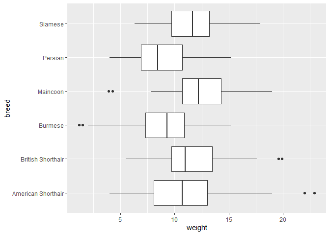

Cats data analysis to practice WORCS
================
16 november, 2021

``` r
# Some visuals and analyses to be reproduced 

# Which breed has the lowest mean weight?
library(ggplot2)
ggplot(CatsData, aes(x = weight, y = breed)) +
  geom_boxplot()
```

<!-- -->

``` r
# Which cat has the highest observed weight?
CatsData[which.max(CatsData$weight),]
```

    ## This is the original data set. The first 6 rows are:
    ## 
    ##     clinic client gender age              breed food_quality     area year
    ## 680     17     20      M   3 American Shorthair            I suburban 2018
    ##     weight BMI
    ## 680   22.9  40

The Persian breed has the lowest mean weight. The heaviest cat (22.9 lbs
measured in 2018) is a male American Shorthair cat of 3 years old in
clinic 17, owned by client 20, living in a suburban area.

This manuscript uses the Workflow for Open Reproducible Code in Science
(Van Lissa et al. 2020) to ensure reproducibility and transparency. All
code <!--and data--> are available at
<git@github.com:Rasila/tryWORCS.git>.

<!--The function below inserts a notification if the manuscript is knit using synthetic data. Make sure to insert it after load_data().-->

<div id="refs" class="references csl-bib-body hanging-indent">

<div id="ref-vanlissaWORCSWorkflowOpen2020" class="csl-entry">

Van Lissa, Caspar J., Andreas M. Brandmaier, Loek Brinkman, Anna-Lena
Lamprecht, Aaron Peikert, Marijn E. Struiksma, and Barbara Vreede. 2020.
“WORCS: A Workflow for Open Reproducible Code in Science,” May.
<https://doi.org/10.17605/OSF.IO/ZCVBS>.

</div>

</div>
